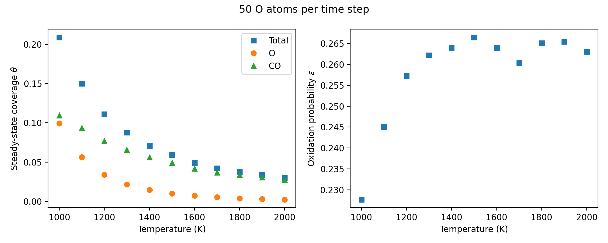
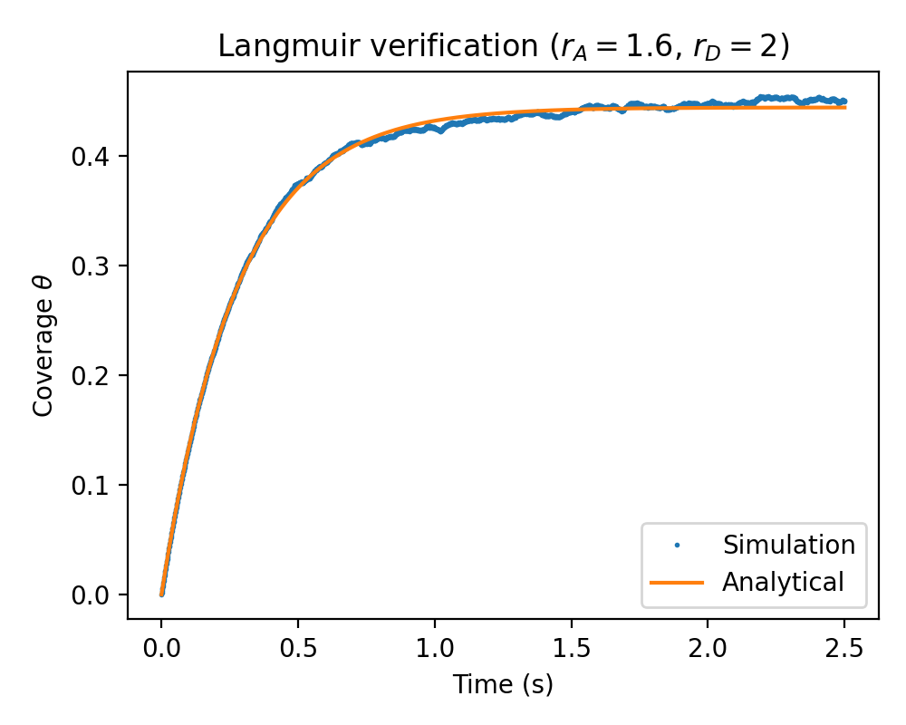
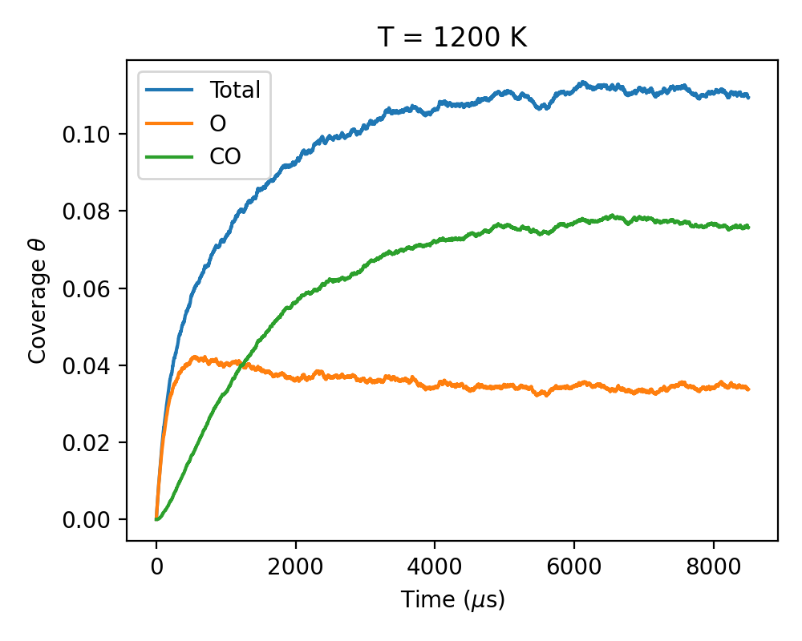

# Stochastic Monte Carlo Model of Langmuir–Hinshelwood Carbon Oxidation by Atomic Oxygen

[](https://github.com/KaanKirmanoglu/MSE485ProjectKirmanogluPalani/actions/workflows/ci.yml)

A C++ Monte Carlo code that simulates competing Langmuir–Hinshelwood (LH) surface mechanisms
for the oxidation of carbon by atomic oxygen on a 2D lattice of adsorption sites. It predicts
steady-state surface coverage and carbon oxidation probability as functions of surface
temperature and incident oxygen flux, and includes a prototype FPGA design that targets roughly
200× acceleration of the per-site update.
### * This is a polished version of the project. Some minor improvements and improvements are done using Claude based on the original source code and presentation. The work used in the course project is in directory Model2021*
*Course project for MSE 485: Atomistic Scale Simulations, University of Illinois Urbana-Champaign
(Fall 2021). Authors: Kaan Kirmanoglu and Kevin Palani.*



## Physics model

Surface reactions and rate constants follow the finite-rate air–carbon ablation model of
Swaminathan-Gopalan et al. (2018) [1, 2]. Each LH mechanism has three steps: adsorption,
formation, and desorption.

| Type | Reaction | Rate constant |
|---|---|---|
| Gas–surface | LH3 O(a) formation | k = 1 |
| Gas–surface | LH3 CO(a) formation | k = θ · 153.0 exp(−4172.8/T) |
| Gas–surface | LH1 O formation/desorption | k = 20.9 exp(−2449.3/T) |
| Gas–surface | LH1 CO formation/desorption | k = θ · 1574.9 exp(−6240.0/T) |
| Desorption | LH3 O(a) desorption | k = 0.05 T² exp(−3177.2/T) |
| Desorption | LH3 CO(a) desorption | k = 4485.5 exp(−1581.4/T) |

θ is the total surface coverage and T is the surface temperature (K).

## Algorithm

At each time step Δt the solver:

1. **Applies gas collisions:** samples a random lattice site for each incident O atom. If the
   site is free, one gas–surface reaction is chosen with probability proportional to its rate.
2. **Advances adsorbates:** each adsorbed particle carries a sampled desorption time
   t_des = −ln(U)/k_des [4] and desorbs once its age exceeds t_des.
3. **Removes desorbed particles** and frees their sites.
4. **Records data:** O, CO and total coverage, plus carbon atoms removed per step.

Oxidation probability is defined as ε = (carbon product flux out) / (oxygen flux in).

## Verification

For pure Langmuir adsorption–desorption, coverage obeys

dθ/dt = r_A (1 − θ) − r_D θ, θ(t) = r_A / (r_A + r_D) · [1 − exp(−(r_A + r_D) t)]

with r_A = S₀ F / B [5]. On the lattice, r_A = (collisions per step) / (number of sites · Δt).
The test `tests/test_langmuir.cpp` runs this case (r_A = 1.6 s⁻¹, r_D = 2 s⁻¹, 100 × 100 sites)
and fails if the simulation deviates from the analytical solution (RMS error < 0.01). It runs
automatically on every push through GitHub Actions.

<p align="center"></p>

## Results

Steady-state coverage and oxidation probability were computed for T = 1000–2000 K and
normalized fluxes F/B = 500–4000. Three regimes appear:

- **High flux (F/B = 4000), rate-limited:** oxidation probability increases with temperature.
- **Low flux (F/B = 500), coverage-limited:** oxidation probability decreases with temperature.
- **Intermediate flux (F/B ≈ 800–1000):** competition between surface coverage and reaction
  rates produces a maximum in oxidation probability with temperature.

These results show that oxidation follows non-Arrhenius behavior that depends on both flux and temperature.

<p align="center"></p>

*Coverage history at T = 1200 K and 50 O atoms per time step: O(a) builds up first, then CO(a)
forms and the surface reaches steady state.*

## FPGA acceleration (prototype)

The lattice update maps naturally onto hardware: each site stores its own state (particle
type, occupancy, desorption timer) and updates independently in parallel. Random numbers come
from 32-bit linear-feedback shift registers, and logarithms from lookup tables.

Post-synthesis estimates for a 16 × 16 grid:

| Metric | Value |
|---|---|
| Logic per site | 76 LUTs, 34 flip-flops (0.14% of device) |
| Critical path | ≈ 14.3 ns (≈ 66 MHz) |
| Time per step | ≈ 150 ns (FPGA) vs. ≈ 30 µs (CPU) |
| Estimated speedup | ≈ 200× |

<!-- If the HDL / Vivado files are included, describe the folder here. Otherwise state: -->
<!-- "The FPGA design is documented in docs/ProjectPresentation.pdf; HDL sources are not included." -->

## Build and run

Requires CMake ≥ 3.17 and a C++11 compiler. Post-processing needs Python 3 with NumPy and Matplotlib.

```bash
git clone https://github.com/KaanKirmanoglu/MSE485ProjectKirmanogluPalani.git
cd MSE485ProjectKirmanogluPalani
cmake -S . -B build -DCMAKE_BUILD_TYPE=Release
cmake --build build

# Verification test
cd build && ctest --output-on-failure && cd ..

# Temperature sweep: ProjectProgram [O atoms per time step] [number of time steps]
./build/ProjectProgram 50 8500

# Steady-state values and plots (written to figures/)
python postprocess.py --flux 50 --show-T 1200
```

The sweep covers T = 1000–2000 K on a 220 × 220 lattice and takes a few seconds. For each
temperature it writes `surfCovTot<T>.txt`, `surfCovO<T>.txt`, `surfCovCO<T>.txt` and
`carbonFlux<T>.txt`, one value per time step. `postprocess.py` averages the last 20% of the run
for steady state and writes `figures/steady_state.txt` and the plots.

Simulation inputs are set in a `solver_inputs` struct:

```cpp
solver_inputs inputs;
inputs.temperature    = 1200;   // K
inputs.surface_size_X = 220;    // lattice sites
inputs.surface_size_Y = 220;
inputs.particle_flux  = 50;     // O atoms hitting the surface per step
inputs.time_step_size = 1e-6;   // s
inputs.time_step_no   = 8500;
inputs.seed           = 1;      // random-number seed
inputs.verbose        = false;  // print coverage at every step
```

## Repository structure

```
main.cpp                temperature sweep and output files
src/solver.{h,cpp}      lattice, reactions, time stepping
src/particle.h          adsorbed-particle state
src/solver_inputs.h     simulation inputs (with defaults)
src/engine.h            random-number wrapper
src/prng_engine.h       Sitmo parallel PRNG (MIT license, M. A. van den Berg)
tests/test_langmuir.cpp Langmuir adsorption–desorption verification test
postprocess.py          steady-state averages and plots
docs/figures/           figures used in this README
```

## References

1. Swaminathan-Gopalan, K., et al. (2018). Development and validation of a finite-rate model for
   carbon oxidation by atomic oxygen. *Carbon*, 137, 313–332.
   [doi:10.1016/j.carbon.2018.04.088](https://doi.org/10.1016/j.carbon.2018.04.088)
2. Swaminathan-Gopalan, K., et al. (2018). Development of a detailed surface chemistry framework in
   DSMC. AIAA Aerospace Sciences Meeting, 2018-0494.
   [doi:10.2514/6.2018-0494](https://doi.org/10.2514/6.2018-0494)
3. Ortega-Zamorano, F., et al. (2016). FPGA hardware acceleration of Monte Carlo simulations for
   the Ising model. *IEEE Trans. Parallel Distrib. Syst.*, 27(9), 2618–2627.
   [doi:10.1109/TPDS.2015.2505725](https://doi.org/10.1109/TPDS.2015.2505725)
4. Molchanova, A., et al. (2015). A detailed DSMC surface chemistry model. *AIP Conf. Proc.*, 1628,
   131–138. [doi:10.1063/1.4902584](https://doi.org/10.1063/1.4902584)
5. Masel, R. I. (1996). *Principles of Adsorption and Reaction on Solid Surfaces.* Wiley, p. 240.

## License

MIT (see `LICENSE`). `src/prng_engine.h` is © M. A. van den Berg, distributed under the MIT license.
